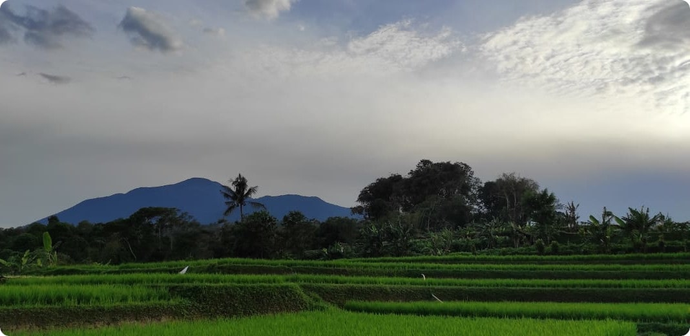

### Hello :wave:, I'm Aris

## Links
- Linkedin - https://www.linkedin.com/in/abdularis
- Medium - https://medium.com/@abdularis

## Stats

  
📊 GitHub Profile Stats

   
  

 
  
💻 Used languages

   
  
   
  <b>Note:</b>  ⚠ This chart is only a metric of which languages my public code on GitHub consists of and does not reflect my experience or skill level.

